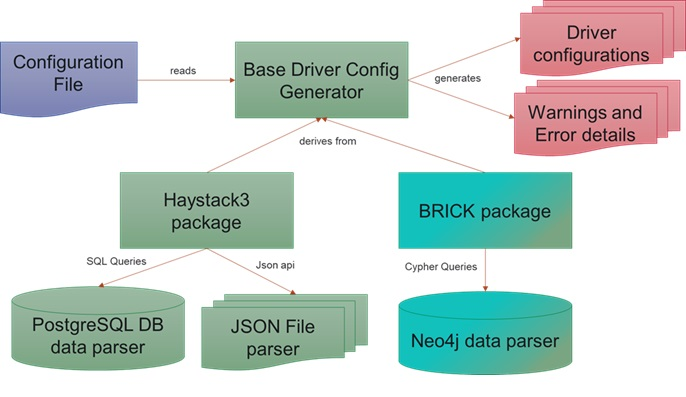
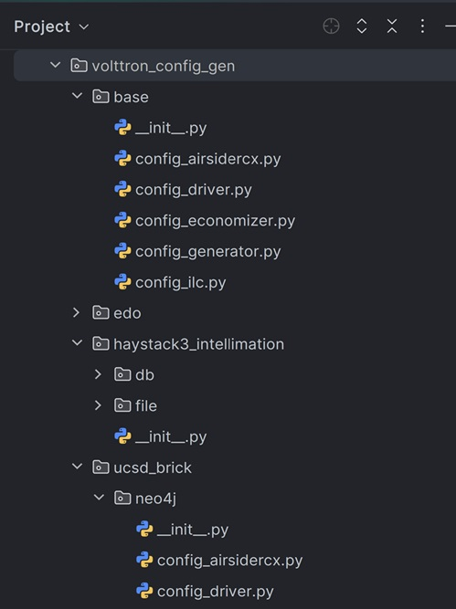

This repository contains code for generating VOLTTRON agent configurations based on different semantic models such as [BRICK](https://brickschema.org/) and [Haystack](https://project-haystack.org/), that define physical, logical assets in buildings and the relationships between them. 


# Architecture
The configuration generator uses an extensible architecture where all agent configuration generators are built on a base generator. This base generator is extended with model-specific and storage-specific implementations. 

For example, for a driver config generator, we have two model-specific packages—one for Haystack3 and one for BRICK—and within Haystack3, there are two storage-specific implementations: one for working with data stored in PostgreSQL databases and another for JSON files. The source code structure follows the same pattern. 
This design makes it easy to add support for new semantic models or storage systems in the future.






### Currently there are reference implementations based on 
1. BRICK 
2. Haystack3 

### Currently configuration generators are available for VOLTTRON agents 

1. Platform Driver Agent 
2. AirsideRCx Agent
3. AirsideEconomizer Agent
4. Intelligent Load Control Agent (ILC)

### Currently supported device types are
1. AHU
2. VAV
3. Lighting for ILC (reference implementation in UCSD brick)

### Currently supported datasources for haystack tags

1. Postgres database that contains haystack tags for equipments, and points.  
2. Json format files - one for equipment tags and one for point tags

### Currently supported data source for BRICK
1. Neo4j 

### Example classes:

1. **base.config_driver.BaseConfigGenerator**: Base class that parses the configuration
2. **haystack3_intellimation.db.config_driver.ConfigGenerator**: Derives from BaseConfigGenerator and reads haystack tags from Intellimation  postgres database and generates platform driver configurations for AHUs and VAVs. 
3. **haystack3_intellimation.file.config_driver.ConfigGenerator**: Derives from BaseConfigGenerator and reads haystack tags from two json files - one for equipment tags and one for point tags - and generates driver configurations for AHUs and VAVs
4. **ucsd_brick.neo4j.config_driver.ConfigGenerator**: Derives from BaseConfigGenerator and reads BRICK semantic tags from a neo4j database

# Running config generators
1. Clone source code:
   ```
   git clone -b develop https://github.com/VOLTTRON/tag-based-config-generators
   cd tag-based-config-generators
   ```
2. Install virtual environment
   You can install these parsers either on system python (for example, when using docker containers exclusively for this) or 
   install in a virtual environment when you are using a environment shared with other projects. 
   Creating virtual environment is highly recommended.
   To create a virtual environment and activate it for use run the command in the root directory of this project
   ```
   python3 -m venv ./.venv
   source .venv/bin/activate
   ```
3. Install parsers
   ```
   cd config_generators
   pip install .
   ```
   or
   ```
   poetry install
   ```
4. Install optional packages specific to your semantic model's data source/storage
	  - For example, If your haystack tags are stored in postgresql database, you need to install python postgresql connector
		   ```
		   pip install psycopg2
		   ```
	- If you are using neo4j db with brick semantic model install python neo4j package
	   ```
	   pip install neo4j
	   ```
5. Create configuration files for the parser that you want to run. Example configurations are available under configurations directory
6. Run parser
    The entry point to all the config generator is a single command "volttron-config-gen" which accepts four parameters
    - the semantic model
    - the data store
    - the agent for which configuration should be generated 
    - the configuration file specific to the generator itself
    Example
    ```
    volttron-confi-gen ucsd_brick neo4j driver configurations/driver/driver.config.ucsd
    ```
   
7. Output:
         1. Generated config files will be in the path provided in configuration. 
         2. Relative path are resolved relative to the directory from which the command is run. 
         3. If no output path is provided in configuration file, then by default output gets written to 
            ```<execution directory>/<site name>_<config type>_configs```. For example, driver configs will be in ```<execution directory>/<site name>_driver_configs```
         4. Details of all devices that couldn't be processed will be in the errors subdirectory
   

# Configuration for DriverConfigGenerator
The configuration file for this config generator script consists of four types of data
1. metadata - that gives the details of where the haystack data is stored and how to access it.  For example, each point's type    could be stored in  a haystack "dis" field. This value is stored in the configuration *point_meta_field*
2. Optional site, campus and building details that can be used to query data and also generate volttron topic names 
   prefix for devices
3. Configuration template - a json object that contains a template driver configuration based on driver type. 
   ConfiGenerator code looks for variables/string patterns in this string and replace it with device specific details 
   for generating individual device configuration
4. Optional output directory into which generated configurations are written. If provided code will try create the 
   directory provided and save generated configurations in it. Relative path are relative to path from which the 
   config generator script is run. If this configuration is not provided, default to 
   "<site name>_driver_configs" driver directory under the code execution directory

Below is an example configuration for where semantic metadata is in a neo4j database
```
  {
     "metadata": {
         "connection_params": {
                "uri": "neo4j://localhost:7687",
                "user": "neo4j",
                "password": "volttron",
                "database": "toupdate"
         }
     },

     # Optional campus. defaults to empty
     # "campus": "",

     # Optional building or site name. defaults to empty
     "building": "ucsd",

     # optional driver topic_prefix. By default devices/<campus>/<building/site>/<device>/<subdevice>,
     # if campus and building information is not provided through site id, campus, building, or topic_prefix then
     # topic would be of the format devices/<device>/<subdevice>
     #"topic_prefix": "devices/campus1/building1",

     # Optional. where generated configs should be saved. Code will try to do makedir -p
     #"output_dir":"/path/to/output/dir",

     # Optional. vip id of the platform driver agent. defaults to platform.driver
     #"driver_vip":"platform.driver",

     # Template for driver configuration
     "config_template": {
        "driver_config": {"device_address": "10.1.1.3",
                          "device_id": 500,
                          "min_priority": 10,
                          "max_per_request": 24
                          },
        "driver_type": "bacnet",
        "registry_config":"config://registry_configs/vav.csv",
        "interval": 60,
        "timezone": "UTC",
        "heart_beat_point": "heartbeat",
        "group": 0
    }
 }
```
If the haystack tags are parsed from a json file, the metadata value in the above configuration can be changed to
```
"metadata": {
        "equip_json": "/path/to/json/Sitename_EQUIP_haystack.json",
        "points_json": "/path/to/json/Sitename_POINTS_haystack.json"
        }
```

Sample configurations can be found [here](configurations/driver)


# Configuration for AirsideRCx generator classes:

The configuration file for this config generator script consists of four types of data
1. metadata - that gives the details of where the haystack data is stored and how to access it
2. Optional site, campus and building details that can be used to query data and also generate volttron topic names 
   prefix for devices
3. Mandatory point metadata - 
   1. information on which field contains the point type information. For example, each point's type could be stored in 
      a haystack "dis" field. This value is stored in the configuration *point_meta_field*
   2. mapping of agent point type to haystack point type. For example, the point that has "fan_status" information 
      could have the metadata "SaFanCmd" in "dis" field of the point.
4. Configuration template - a json object that contains a template airsidercx configuration. 
   ConfiGenerator code inserts the campus, building, AHU, its vavs, and the point name details in this template and 
   generates one AirsideRCx config for each AHU
5. Optional output directory into which generated configurations are written. If provided code will try to create the 
   directory provided and save generated configurations in it. Relative path are relative to path from which the 
   config generator script is run. If this configuration is not provided, default to 
   "<site name>_airsidercx_configs" directory under the code execution directory

Below is an example configuration where metadata is in a postrgres database
```
  {
     "metadata": {
        "connection_params": {
                "dbname": "intellimation",
                "host": "127.0.0.1",
                "port": 5432,
                "user": "postgres",
                "password": "volttron"
            },
        "equip_table": "equipment",
        "point_table": "points"
        },
     "site_id": "r:intellimation.dc_dgs.dcps.brookland_ms",
     # optional. if not provided will be derived from site_id.split('.')[-2]
     #"campus": "dcps",
     # optional. if not provided will be derived from site_id.split('.')[-1]
     #"building": "brookland_ms",

     # metadata value to indentity the specific points and hence its name in this setup
     "point_meta_map": {
            "fan_status": "s:SaFanCmd",
            "zone_reheat": "s:RhtVlvPos",
            "zone_damper": "s:DmpCmd",
            "duct_stcpr": "s:SaPress",
            "duct_stcpr_stpt": "s:SaPressSp",
            "sa_temp": "s:SaTemp",
            "fan_speedcmd": "s:SaFanSpdCmd",
            "sat_stpt": "s:SaTempSp"
        },
     # The field that contains the above point metadata
     "point_meta_field": "dis",

     "output_dir":"output/brookland_aircx_configs",
     "config_template": {
        "analysis_name": "AirsideAIRCx",
        "device": {

        },
        "actuation_mode": "passive",
        "arguments": {
            "point_mapping": {

            }
            #### Uncomment to customize thresholds (thresholds have single #)
            #### If uncommenting any parameters below add a comma after point_mapping
            #### and remove any trailing commas to make it a valid json
            #### Only uncommented lines will get written into generated config
            # "no_required_data": 10,
            # "sensitivity": custom

            ### auto_correct_flag can be set to false, "low", "normal", or "high" ###
            # "auto_correct_flag": false,
            #"warm_up_time": 5,

            ### data_window - time duration for data collection prior to analysis_name
            ### if data_window is ommitted from configuration defaults to run on the hour.

            ### Static Pressure AIRCx Thresholds ###
            # "stcpr_stpt_deviation_thr": 20
            # "warm_up_time": 5,
            # "duct_stcpr_retuning": 0.1,
            # "max_duct_stcpr_stpt": 2.5,
            # "high_sf_thr": 95.0,
            # "low_sf_thr": 20.0,
            # "zn_high_damper_thr": 90.0,
            # "zn_low_damper_thr": 10.0,
            # "min_duct_stcpr_stpt": 0.5,
            # "hdzn_damper_thr": 30.0,

            ### SAT AIRCx Thresholds ###
            # "sat_stpt_deviation_thr": 5,
            # "percent_reheat_thr": 25.0,
            # "rht_on_thr": 10.0,
            # "sat_high_damper_thr": 80.0,
            # "percent_damper_thr": 60.0,
            # "min_sat_stpt": 50.0,
            # "sat_retuning": 1.0,
            # "reheat_valve_thr": 50.0,
            # "max_sat_stpt": 75.0,

            #### Schedule/Reset AIRCx Thresholds ###
            # "unocc_time_thr": 40.0,
            # "unocc_stcpr_thr": 0.2,
            # "monday_sch": ["5:30","18:30"],
            # "tuesday_sch": ["5:30","18:30"],
            # "wednesday_sch": ["5:30","18:30"],
            # "thursday_sch": ["5:30","18:30"],
            # "friday_sch": ["5:30","18:30"],
            # "saturday_sch": ["0:00","0:00"],
            # "sunday_sch": ["0:00","0:00"],

            # "sat_reset_thr": 5.0,
            # "stcpr_reset_thr": 0.25
        }
    }
 }

```
If the haystack tags are parsed from a json file, the metadata value in the above configuration can be changed to
```
"metadata": {
        "equip_json": "/path/to/json/Sitename_EQUIP_haystack.json",
        "points_json": "/path/to/json/Sitename_POINTS_haystack.json"
        }
```
Sample configurations can be found [here](configurations/airsidercx)

**Note:**

 All the commented fields in the config_template or optional AirsideRCx configuration parameters and the commented 
 values are the default values used by the AirsideRCx agent. If you would like to uncomment and include any of these 
 parameters in your generated configurations, please make sure you add or remove any trailing commas to make the value 
 of "config_template" a valid json string. Commented line are for informational purpose only. None of the commented 
 lines will be in the final generated configuration.


# Configuration for AirsideEconomizer config generator classes:

The configuration file for this config generator script consists of four types of data
1. metadata - that gives the details of where the haystack data is stored and how to access it
2. Optional site, campus and building details that can be used to query data and also generate volttron topic names 
   prefix for devices
3. Mandatory point metadata - 
   1. information on which field contains the point type information. For example, each point's type could be stored in 
      a haystack "dis" field. This value is stored in the configuration *point_meta_field*
   2. mapping of agent point type to haystack point type. For example, the point that has "supply_fan_status"  
      information could have the metadata "SaFanCmd" in "dis" field of the point.
4. Configuration template - a json object that contains a template airside economizer configuration. 
   ConfiGenerator code inserts the campus, building, AHU, and the point name details in this template and 
   generates one AirsideEconomizer agent config for each AHU
5. Optional output directory into which generated configurations are written. If provided code will try to create the 
   directory provided and save generated configurations in it. Relative path are relative to path from which the 
   config generator script is run. If this configuration is not provided, default to 
   "<site name>_airside_economizer_configs" directory under the code execution directory

Below is an example configuration where metadata is in a postrgres database
```
  {
     "metadata": {
        "connection_params": {
                "dbname": "intellimation",
                "host": "127.0.0.1",
                "port": 5432,
                "user": "postgres",
                "password": "volttron"
            },
        "equip_table": "equipment",
        "point_table": "points"
        },
     "site_id": "r:intellimation.dc_dgs.dcps.brookland_ms",
     # optional. if not provided will be derived from site_id.split('.')[-2]
     #"campus": "dcps",
     # optional. if not provided will be derived from site_id.split('.')[-1]
     #"building": "brookland_ms",

     # metadata value to indentity the specific points and hence its name in this setup
     "point_meta_map": {
            "fan_status": "s:SaFanCmd",
            "zone_reheat": "s:RhtVlvPos",
            "zone_damper": "s:DmpCmd",
            "duct_stcpr": "s:SaPress",
            "duct_stcpr_stpt": "s:SaPressSp",
            "sa_temp": "s:SaTemp",
            "fan_speedcmd": "s:SaFanSpdCmd",
            "sat_stpt": "s:SaTempSp"
        },
     # The field that contains the above point metadata
     "point_meta_field": "dis",

     "output_dir":"output/brookland_aircx_configs",
     "config_template": {
        "device": {

        },
        "analysis_name": "Economizer_AIRCx",
        "actuation_mode": "passive",
        "arguments": {
            "point_mapping": {

            },
            "device_type": "ahu",
            "data_window": 30,
            "no_required_data": 10,
            "open_damper_time": 0,
            "low_supply_fan_threshold": 20.0,
            "mat_low_threshold": 50.0,
            "mat_high_threshold": 90.0,
            "oat_low_threshold": 30.0,
            "oat_high_threshold": 100.0,
            "rat_low_threshold": 50.0,
            "rat_high_threshold": 90.0,
            "temp_difference_threshold": 4.0,
            "open_damper_threshold": 90.0,
            "oaf_temperature_threshold": 4.0,
            "cooling_enabled_threshold": 5.0,
            "minimum_damper_setpoint": 10.0,
            "desired_oaf": 10.0,
            "rated_cfm": 1000.0,
            "eer": 10.0,
            "economizer_type": "DDB",
            "temp_band": 1.0
        }
     }
 }

```
If the haystack tags are parsed from a json file, the metadata value in the above configuration can be changed to
```
"metadata": {
        "equip_json": "/path/to/json/Sitename_EQUIP_haystack.json",
        "points_json": "/path/to/json/Sitename_POINTS_haystack.json"
        }
```
Sample configurations can be found [here](configurations/economizer)

# Configuration for ILC config generator classes:

The configuration file for this config generator script consists of the following types of data
1. metadata - that gives the details of where the haystack data is stored and how to access it
2. Optional site, campus and building details that can be used to query data and also generate volttron topic names 
   prefix for devices
3. Optional output directory into which generated configurations are written. If provided code will try to create the 
   directory provided and save generated configurations in it. Relative path are relative to path from which the 
   config generator script is run. If this configuration is not provided, default to 
   "<site name>_ilc_configs" directory under the code execution directory 
4. Configuration to identify whole building power meter. This required for ILC. This SHOULD MATCH the device name used by driver so that topic names match. (devices/<campus>/<building>/<building_power_meter> should be the topic prefix for the driver data)
	- The power meter can be identified based on a semantic tag. In this case,  use the configuration *building_power_meter* 
	- In the case where there is no real building power meter, a simulated one can be used. In this case, provide values for the configurations  *building_power_meter* and *building_power_point*
5. Mandatory point metadata - metadata value to identify the specific points and hence its name in this setup. For ILC, this should include all points used in control and criteria configs. This includes
    - information on which field contains the point type information. For example, each point's type could be stored in 
      a haystack "dis" field. This value is stored in the configuration *point_meta_field*
   - mapping of agent point type to haystack point type. For example, the point that has "supply_fan_status"  
      information could have the metadata "SaFanCmd" in "dis" field of the point.
   - point mapping is grouped based on device types - power_meter, vav, lighting, occupancy_detector
      
6. Optional default point mapping. This is used when a device point cannot be mapped correctly. This is useful when we know the common naming pattern for points and some devices could have missing semantic metadata information. This is set using the configuration *point_default_map* and has the same grouping of points by device type
7. Configuration template - a json object that contains a template for ilc configurations. The template can hold default values and all mandatory fields, and the config generator will fill appropriate values for discovered values such as device ip, point names etc. For ILC, this contains template for main ilc agent config, control configuration and criteria configuration.
8. zone type configuration is provided as value for the parameter, *mapper_config*. This get pulled into criteria config file

Below is an example configuration for where metadata is in a neo4j database
```
 {
     "metadata": {
         "connection_params": {
                "uri": "neo4j://localhost:7687",
                "user": "neo4j",
                "password": "volttron",
                "database": "updatedmodel"
         }
     },

     # optional. should match what is used for corresponding driver config
     #"campus": "campus1",

     # optional. should match what is used for corresponding driver config
     "building": "ucsd",

     ######### Configuration to identify whole building power meter. This required for ILC.  ##################
     ######### SHOULD MATCH the device name used by driver so that topic names match. ###########
     ######### i.e. devices/<campus>/<building>/<building_power_meter> should be the topic prefix for the driver data

     #### Ways to be supported to identity power meter ####

     #### 1. Identify based on BRICK TAG ####

     # Optionally, a custom power meter topic name can be provided using the configuration "building_power_meter",
     # in this case power meter device and its points are identified using BRICK labels but configured
     # "building_power_meter" is
     # used to derive device topic name, devices/<campus>/<building>/<building_power_meter>

     ##### 2. When there is no power meter and agent is used to post data as powermeter - i.e. simulated power meter
     ##### specify both the "building_power_meter" and "building_power_point" attributes. In this case, config
     ##### generator will not do any validation of the device and generate ilc config with given names

     "building_power_meter": "custom_building_meter_topic",
     "building_power_point": "configured_fake_power_point",

     # metadata value to identify the specific points and hence its name in this setup
     # Should include all points used in control and criteria configs.
     "point_meta_map": {
        #"power_meter": {
        #    "WholeBuildingPower": "ActivePowerSensor"
        #    },
        "vav": {
            "CoolingOutputPercent": "CoolingOutputPercent",
            "AirFlowSetPoint": "SupplyAirFlowSetpoint",
            "ZoneTemperature": "ZoneTemperature",
            "EffectiveZoneCoolingTemperatureSetPoint": "EffectiveAirTemperatureCoolingSetpoint",
            "OccupiedZoneCoolingTemperatureSetPoint":  ["OccupiedCoolingTemperatureSetpoint"],
            "OccupancyCommand": "OccupancyStatus"
            },
        "lighting": {
            "DimmingLevelOutput": "LuminanceCommand",
            "Power": "ActivePowerSensor"
        },
        "occupancy_detector":{
            "OccupancySensor": "OccupancySensor"
        }
     },

     # optional point default value if no point name can be found using metadata/tags a default value can be provided
     # useful in cases where we know point exists but tagging is incomplete.
     # keys for below dict should be subset of key in point_meta_map

     #"point_default_map": {
     #   "vav": {
     #     "ZoneCoolingTemperatureSetPoint" : "default_zone_cooling_temp_sp",
     #     "MinimumAirFlow": "default_minimum_airflow",
     #     "ZoneAirFlow": "default_zone_airflow",
     #     "MaxAirFlow": "default_maxairflow",
     #     "ZoneTemperature": "default_zntemp",
     #     "OccupancyCommand": "default_occ_cmd"
     #    },
     #  "power_meter": {
     #  },
     #  "lighting": {
     #      "DimmingLevelOutput" : "default_dim_level",
     #      "Power": "DefaultActivePowerSensor"
     #  }
     #},

     # The field that contains the above point metadata
     "point_meta_field": "Label",

     # Optional directory where all generated configs should go
     #"output_dir":"ilc_configs_from_config1",

     # Optional ilc agent's vip identity. defaults to platform.ilc
     # "ilc_agent_vip": "platform.ilc",

     "config_template": {

        # ###### Pairwise criteria #######
        # device type determines the pairwise criteria file used.
        # pairwise_criteria_<device_type>.json file from the data folder will be used for ILC
        # You can customize this json file for your needs. If you customize this json file, you could also
        # enable validation for this configuration file
        # Validation of pairwise_criteria uses ilc/utils/validate_pairwise.py

        "validate_pairwise_criteria": false,

        # ########### ilc config template ########
        "ilc_config":{
            # device specific cluster config
            "cluster_config": {
                "vav":{
                    "cluster_priority": 0.5,
                    "cluster_actuator": "platform.actuator"
                },
                "lighting":{
                    "cluster_priority": 0.5,
                    "cluster_actuator": "lighting.actuator"
                }
            },
            "demand_limit": "TRIGGER",
            "simulation_running": false,
            "control_time": 20,
            "control_confirm": 5,
            "average_building_power_window": 15,
            "stagger_release": true,
            "stagger_off_time": false
        },

        # ######### control config template ########
        "control_config":{
            "vav": {
                "device_topic": "",
                "curtail_settings": {
                    "load": "0.5",
                    "control_method": "offset",
                    "offset": 2.0,
                    "minimum": 70.0,
                    "maximum": 76.0,
                    # only one curtail setting and one point per curtail setting?
                    "point": "OccupiedZoneCoolingTemperatureSetPoint"
                },
                "device_status": {
                    # More than one curtail possible?
                    "curtail": {
                        "device_status_args": ["CoolingOutputPercent", "OccupancyCommand"],
                        "condition": ["(CoolingOutputPercent>10) & (Eq(OccupancyCommand, 0))"]
                    }
                }
            },
            "lighting": {
                "device_topic": "",
                "device_status": {
                    "curtail": {
                        "condition": ["AVG(DimmingLevelOutput) > 70"],
                        "device_status_args": "LIST(DimmingLevelOutput)"
                    }
                },
                "curtail_settings": {
                    "point": "DimmingLevelOutput",
                    "value": 0.7,
                    "control_method": "value",
                    "load": {
                        "operation":  "SUM(Power * (DimmingLevelOutput - 70) / DimmingLevelOutput)",
                        "equation_args": "LIST(Power, DimmingLevelOutput)"
                    }
                },
                "release_trigger": {
                    "curtail": {
                        "condition": [ "OccupancySensor < 1" ],
                        "device_status_args": [ "OccupancySensor"]
                    }
                }
            }
        },

        # ############ criteria config template #########
        "criteria_config":{
            "vav": {
                "room_type": {
                    "map_key": "Office",
                    "operation_type": "mapper",
                    "dict_name": "zone_type"
                },
                "available_zone_airflow_ratio": {
                        "operation_type": "formula",
                        "operation": "CoolingOutputPercent",
                        "minimum": 0.0,
                        "maximum": 10.0,
                        "operation_args": ["CoolingOutputPercent"]
                        },
                "box_size": {
                        "operation_type": "formula",
                        "operation": "AirFlowSetPoint*(100.0/CoolingOutputPercent)",
                        "minimum": 0.0,
                        "operation_args": ["AirFlowSetPoint", "CoolingOutputPercent"]
                    },
                "zonetemperature_setpoint": {
                        "operation": "1/(ZoneTemperature - EffectiveZoneCoolingTemperatureSetPoint)",
                        "operation_type": "formula",
                        "operation_args": {
                            "always": [
                                "ZoneTemperature"
                            ],
                            "nc": [
                                "EffectiveZoneCoolingTemperatureSetPoint"
                            ],
                            "minimum": 0.0,
                            "maximum": 10.0
                        }
                }
            },
            "lighting": {
                "room_type": {
                    "map_key": "Conference Room",
                    "operation_type": "mapper",
                    "dict_name": "zone_type"
                },
                "lighting_level": {
                    "operation": "AVG(DimmingLevelOutput)",
                    "operation_type": "formula",
                    "operation_args": "LIST(DimmingLevelOutput)"
                },
                "rated_power": {
                    "operation": "SUM((Power * 100) / DimmingLevelOutput)",
                    "operation_type": "formula",
                    "operation_args": "LIST(Power, DimmingLevelOutput)"
                }
            }
        },

        # ######### zone type configuration that is part of criteria config file#################
        "mapper_config":{
            "zone_type": {
                "Computer Lab": 2,
                "Conference Room": 1,
                "Directors office": 1,
                "Empty Office": 7,
                "Kitchen": 6,
                "Mechanical Room": 9,
                "Mixed": 4,
                "Office": 3
            }
        }
    }
 }
```
